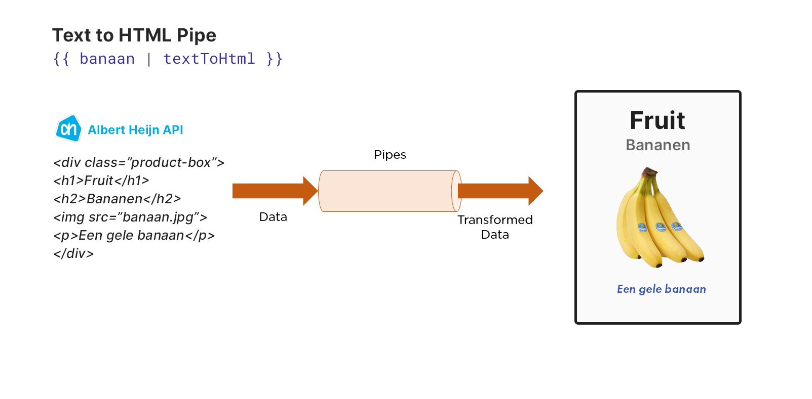

# Angular workshop

Deze workshop is toegespitst op het visualiseren van 3D en data in web apps. Dit vanwege onze eigen werkzaamheden, maar ook met het oog op onze toekomstige samenwerking met het data team.

---

**Inhoudstabel**

- [Angular workshop](#angular-workshop)
  - [Angular](#angular)
  - [NPM en node packages](#npm-en-node-packages)
  - [Angular installation](#angular-installation)
  - [@Component](#component)
  - [Modules](#modules)
  - [Pipes](#pipes)
  - [@Input](#input)
  - [@Output](#output)
  - [Services](#services)
  - [Directives](#directives)
    - [Directive Types](#directive-types)
  - [Angular fundamentale concepten](#angular-fundamentale-concepten)
  - [Observables](#observables)
  - [Mapbox \& ngx-mapbox](#mapbox--ngx-mapbox)
  - [ThreeJS \& NG3](#threejs--ng3)
  - [PrimeNg (component library)](#primeng-component-library)
  - [Nawoord](#nawoord)
    - [Pluspunten](#pluspunten)
    - [Minpunten](#minpunten)
  - [Vervolg](#vervolg)

## Angular

[Angular](https://angular.io/docs) is een application-design framework en development platform voor het ontwikkelen van efficiënte en complexe single-page applicaties.

**Traditionele website**

**Single-page applicatie (SPA)**

## NPM en node packages

- Node package manager (NPM) is een manager waarmee je de node packages in je applicatie kunt beheren. Vergelijkbaar met Unity's package manager of Nuget package manager
- Installeer [Node.js](https://nodejs.org/en/) om node packages te kunnen installeren via NPM commands in de terminal
- Packages en diens versies worden bijgehouden in *package.json* (vergelijkbaar met Unity's manifest.json), hier kun je ook wijzigingen aan toe brengen
- Je installeert een nieuwe node package via terminal m.b.v. `npm install [package-naam]`, deze package wordt dan geïnstalleerd in de *node_modules* folder

## Angular installation

1. Open terminal
2. Run `npm install -g @angular/cli`
3. Check of je **Angular versie 15** globaal installed hebt met `ng v`
4. Open een folder waar je de Angular applicatie wil installeren
5. Run `ng new angular-workshop`
6. Gebruik **SCSS** als stylesheet en gebruik **Router**
  
## @Component

- Is een Decorator (design pattern)
- Vergelijkbaar met een attribute in Unity: zie de component decorator een beetje als een *monobehaviour attribute*
- Koppelt metadata aan een class - in dit geval om een compoennt te definieren. Voorbeeld van de metadata zijn *lifecycle methods* zoals `OnInit`
- Om een *Component* te maken gaan we we vanuit de *root* folder van ons project in de *app* folder. Dit doen we via de terminal (gebruik `cd [folder-naam]` om van directory te switchen)
- Nu kunnen we een component aanmaken m.b.v. `ng generate compont [component-naam]`

## Modules

[NgModules](https://angular.io/guide/architecture-modules) zijn containers voor een samenhangend codeblok dat is toegewezen aan een applicatie domein, een workflow of een nauw verwante reeks mogelijkheden.

- Enigszins vergelijkbaar met een `namespace`; je bakent modules en components die behoren aan een onderdeel af van de andere onderdelen van de applicatie
- Kunnen *components*, *service providers*, en andere code files bevatten afhankelijk van hun scope
- Kunnen functionaliteit importeren wat geëxporteerd is uit andere NgModules, en kunnen zelf specificieke functionaliteit exporteren wat gebruikt kan worden door andere NgModules

## Pipes

- **Pipes** kun je inzetten om data te converteren of formatteren naar bijvoorbeeld string, valuta's, datum en andere datatypes
- Je kunt ook [custom pipes](https://angular.io/guide/pipes-custom-data-trans) maken zoals een conversie van platte tekst naar HTML, of voor vertalingen
- Een custom pipe kun je aanmaken via de terminal (in de *app* directory) m.b.v. `ng generate pipe [pipe-naam]`

## @Input

- Enigszins vergelijkbaar met `serializeField` van Unity
- Maakt het mogelijk om van 'buitenaf' de *component* informatie als input mee te geven
- Op deze wijze kan vanuit een parent component data doorgestuurd worden naar een child component (een component kan namelijk niet data onttrekken uit een andere component)

## @Output

- [Output](https://angular.io/guide/inputs-outputs) kan gebruikt worden om data van een *child* naar een *parent* te sturen
- Manier om content te updaten in de parent zonder een *service* of iets dergelijks te hoeven gebruiken
- Kan opgesteld worden met behulp van `@Output` en `EventEmitter`

Voorbeeld van zowel *Input* als *Output* data flow tussen *Child* en een *Parent*

## Services

Een [service](https://angular.io/guide/architecture-services) is gebruikelijk een *class* met een toegespitst, goed gedefinieerd doel. "It should do something specific and do it well" (Single Responsibility principe).

- Is een decorator die gebasseerd is op het *Dependency Injection* design pattern
- Kun je aanmaken via de terminal (in de *app* directory) m.b.v. `ng generate service [service-naam]`
- Kun je injecteren in een *component* of andere *service* via diens `constuctor`
- Een component gebruikt services voor taken waarbij de *view* of *application logic* niet komt kijken
- Services zijn goed in taken als het *fetchen* van data van een server, het valideren van user input, of om direct naar de console te loggen
- Door zulke taken uit te werken in een *injectable* service class, kun je die taken (of functionaliteit) beschikbaar stellen aan iedere component

## Directives

Angular directives worden gebruikt om de kracht van HTML uit te breiden door het een nieuwe syntax te geven. Het creëert DOM-elementen, verandert hun structuur of hun gedrag.

### [Directive Types](https://medium.com/@tanvishah1409/beginner-in-angular-types-of-angular-directives-f5171e6bfdce)

- **Component**: directive met een template
- **Structure directives**: veranderen layout van elements; `*ngIf` en `*ngFor` zijn voorbeelden hiervan
- **Attribute directive**:
  - Generieke functionaliteit die je aan een HTML component toe kan voegen
  - Vergelijkbaar met bijvoorbeeld `IPointerEnterHandler` uit Unity
  - Zou je kunnen gebruiken voor iets als een generieke *[highlighter](https://angular.io/guide/attribute-directives)* of *dropzone* functionaliteit dat gekoppeld kan worden aan HTML components
- Kun je aanmaken via de terminal (in de *app* directory) m.b.v. `ng generate directive [directive-naam]`

## Angular fundamentale concepten

Hieronder een korte samenvatting van alle fundamentele concepten van Angular en hoe ze onderling aan elkaar relateren.

## Observables

[RxJS](https://rxjs.dev/guide/overview) is een library voor het samenstellen van asynchrone en event-based programma's door het gebruik van *observable sequences*. RxJS biedt een core type, de **Observable**, satellite types (Observer, Schedulers, Subjects) en operators geïnspireerd door `Array` methods (`map`, `filter`, `reduce`, `every`, etc) die *asynchronous events* afhandelen als *collections*.

- Vergelijkbaar met *observer pattern*
- Je kunt je subscriben aan de observable; wanneer de observable data (bv. in de backend) wijzigt, dan zal dit ook automatisch in de front-end updaten
- Voorbeeld: je front-end weergeeft data uit een database. De database date update uiteraard regelmatig en deze changes moeten dan automatisch zichtbaar zijn in je front-end.

> Laat OPK zien met Firebase database m.b.t. de *documents* hoe dit automatisch update

## Mapbox & ngx-mapbox

- Met [Mapbox](https://docs.mapbox.com/mapbox-gl-js/example/) kun je geografische kaarten toevoegen aan een web app
- Op deze map kan data geprojecteerd worden in de vorm van *layers*. Deze layers kunnen vanalles bevatten: 3D modellen, markers (points of interest), icons, GIS data, heatmaps en meer
- **ngx-mapbox** biedt de mogelijkheid om templates op te bouwen met behulp van *directives* op de 'Angular manier'

## ThreeJS & NG3

- [ThreeJS](https://threejs.org/) is een WebGL library die gebruikt kan worden voor het ontwikkelen van 3D scenes in het web
- Run in terminal: `npm install threejs --save` en daarna `npm install @types/three --save`
- **ThreeJS** kan ook in samenwerking met Mapbox gebruikt worden om bijvoorbeeld 3D modellen op een map te renderen of markers met daarin panorama afbeeldingen toe te voegen (zoals in de **[Omgevings Plankaart](https://producten.movares-visuals.nl/3D_Webportaal)**)
- Een 'Vanilla ThreeJs implementatie' in Angular kan echter al snel veel overhead veroorzaken in je *components*
- **NG3** is alternatief; werkt vergelijkbaar met hoe je templates op basis van *directives* uitwerkt in Angular
- [NG3 Sandbox Examples](https://angular-three.netlify.app/examples/home)
- NG3 kun je [installen](https://angular-three.netlify.app/docs/getting-started/installation) door de volgende commands te runnen in je terminal:
  - `npm install --save-dev @angular-three/schematics`
  - `npm install @angular-three/core three@~0.142`
  - `npm install --save-dev @types/three@~0.142`

## PrimeNg (component library)

- Bevat [componenten](https://www.primefaces.org/primeng/button) met dezelfde look & feel
- Biedt kant-en-klare componenten aan met een specifieke data input opties, functionaliteit en styling die je eraan kan binden
- Customizable naar een bepaald thema (bv. volgens een stijlgids)
- Waarborgt uniformiteit, herkenbaarheid en consistentie in het design richting je gebruikers — verbetert in het algemeen de usability van de website volgens UX richtlijnen
- PrimeNg [installeer](https://www.primefaces.org/primeng/setup) en importeer je in je project op de volgende wijze:
  1. Run de commands `npm install primeng --save` en `npm install primeicons --save` in de terminal
  2. Importeer de componenten die je wil gebruiken in de **app.module**. Voorbeeld: `import {AccordionModule} from 'primeng/accordion';`
  3. Voeg het gewenste PrimeNg thema toe in **angular.json**. Voorbeeld: `"styles": ["node_modules/primeicons/primeicons.css", "node_modules/primeng/resources/themes/lara-light-blue/theme.css", "node_modules/primeng/resources/primeng.min.css"]`
- Extra informatie over hoe PrimeNg ingezet kan worden in onze web app is te vinden op onze [styleguide pagina](https://styleguide.movares.net)
  
## Nawoord

Wat zijn nu de voordelen en nadelen van het gebruik van Angular in combinatie met deze libraries t.o.v. een engine als Unity?

### Pluspunten

- Distributie: bereik van de applicatie is groter en laagdrempeliger om in gebruik te nemen
- Cross platform: Unity biedt vele cross platform mogelijkheden, maar nog niet op het niveau van een website uitrollen die bruikbaar is op alle apparaten
- Aanpassingen zijn doorgaans meer flexibel vanwege de tekstuele uitwerkingen van features
- Externe, bekende libraries en packages zijn vaak van enorm hoge kwaliteit door het massaal aantal gebruikers (bv. Web Mapbox vs. Unity Mapbox)
- Erg wendbaar wat betreft het koppelen van je web app aan andere systemen zoals servers, api's, databases, etc.
  
### Minpunten

- Kan meer tijd kosten om componenten en diens layout uit te werken omdat je geen editor hebt (vrijwel alles moet tekstueel uitgewerkt worden)
- Hoewel met WebGL levendige en interactieve scenes ontwikkeld kunnen worden, kan het niet tippen aan de 3D features en graphics die Unity aanbiedt
- Processing power van een website heeft meer beperkingen dan een standalone applicatie

## Vervolg

Zijn er nog andere technieken die wel graag willen bespreken (in relatie tot Angular of web apps) in een andere sessie? Topics zoals:

- Het koppelen van een database en weergeven van diens data
- Het zenden van API requests en ontvangen van responses
- Opzetten van en communiceren met een back-end zoals ASP .NET of Flask/Django (deze laatste zijn interessant vanwege het achterliggende Python ecosysteem)
- Geautomatiseerd testen met Cypress
- Iets anders...
